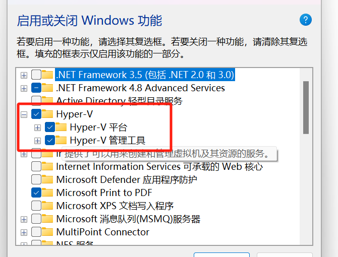
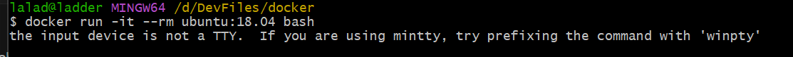
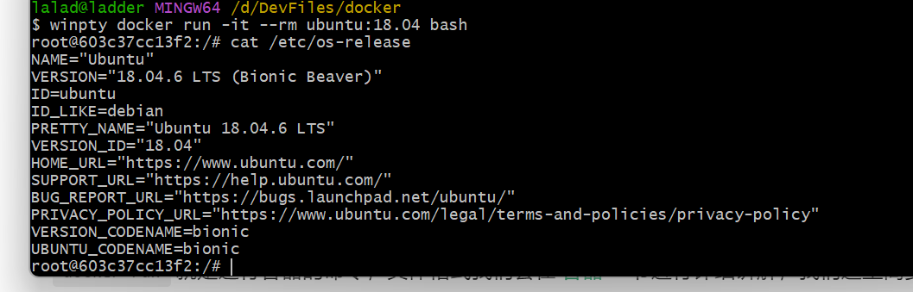

## 1. docker基础准备
- 参考资料 https://vuepress.mirror.docker-practice.com
### 下载docker桌面版
- 由于我是windows 系统，所以需要下载docker桌面版，以便使用命令行
- 下载地址：https://www.docker.com/products/docker-desktop/ 下载对应版本
  
- 要想在windows下运行docker,需要开启Hyper-V功能
  控制面板 > 程序 > 启用或关闭Windows功能，打开Hyper-V以及他的子功能
  
  
  
- 做好以上，则可以开始进行学习入门了

## 2. docker入门学习
### 1. docker的基本概念
**Docker** 包括三个基本概念
- 镜像（images/image）
- 容器（Container）
- 仓库（Repository）
#### Docker镜像（images/image）
  **Docker镜像**是一个特殊的文件系统，除了提供容器运行时所需的程序、库、资源、配置等文件外，还包含了一些为运行时准备的一些配置参数（如匿名卷、环境变量、用户等）。镜像 不包含 任何动态数据，其内容在构建之后也不会被改变。
#### Docker容器
镜像（```images/image```）和容器（```Container```）的关系，就像是面向对象程序设计中的```类```和```实例```一样，镜像是静态的定义，容器是镜像运行时的实体。容器可以被创建、启动、停止、删除、暂停等。

容器的实质是进程，但与直接在宿主执行的进程不同，容器进程运行于属于自己的独立的**命名空间**(opens new window)。因此容器可以拥有自己的 root 文件系统、自己的网络配置、自己的进程空间，和自己的用户**ID**空间。

容器消亡时，容器存储层也随之消亡。因此，任何保存于容器存储层的信息都会随容器删除而丢失。

按照 Docker 最佳实践的要求，容器不应该向其存储层内写入任何数据，容器存储层要保持无状态化。所有的文件写入操作，都应该使用 数据卷（Volume）、或者 绑定宿主目录，在这些位置的读写会跳过容器存储层，直接对宿主（或网络存储）发生读写，其性能和稳定性更高。

数据卷的生存周期独立于容器，容器消亡，数据卷不会消亡。因此，使用数据卷后，容器删除或者重新运行之后，数据却不会丢失。
#### Docker 仓库
当镜像构建完成之后，则可以在本机服务使用，但若想在其他服务器上使用，则需要一个集中的分发镜像的仓库
#### Docker Registry 公开服务
Docker Registry 公开服务是开放给用户使用、允许用户管理镜像的 Registry 服务。一般这类公开服务允许用户免费上传、下载公开的镜像，并可能提供收费服务供用户管理私有镜像。
最常使用的 Registry 公开服务是官方的[Docker Hub](https://hub.docker.com/), 国内有[阿里加速器](https://www.aliyun.com/product/acr?source=5176.11533457&userCode=8lx5zmtu)，网易等。
#### 私人仓库
Docker官方也提供了私人镜像仓库，以下是简单练习使用后的仓库

### 2. 获取第一个docker镜像
从docker官方镜像录取镜像
~~~
docker pull [选项] [Docker Registry 地址[:端口号]/]仓库名[:标签]

docker pull [OPTIONS] NAME[:TAG|@DIGEST]
~~~
可以使用```docker pull --help```命令查看
- Docker 镜像仓库地址：地址的格式一般是```<域名/IP>[:端口号]```。默认地址是 Docker Hub(```docker.io```)
- 仓库名：如之前所说，这里的仓库名是两段式名称，即```<用户名>/<软件名>```。对于 ```Docker Hub```，如果不给出用户名，则默认为```library```，也就是官方镜像。
- 例如
~~~sh
$ docker pull ubuntu:18.04
18.04: Pulling from library/ubuntu
7c457f213c76: Pulling fs layer
7c457f213c76: Verifying Checksum
7c457f213c76: Download complete
7c457f213c76: Pull complete
Digest: sha256:152dc042452c496007f07ca9127571cb9c29697f42acbfad72324b2bb2e43c98
Status: Downloaded newer image for ubuntu:18.04
docker.io/library/ubuntu:18.04
~~~
上面的命令中没有给出```Docker```镜像仓库地址，因此将会从Docker Hub（```docker.io```）获取镜像。镜像名称是```ubuntu:18.04```，因此将会获取官方镜像```library/ubuntu```仓库中标签为```18.04```的镜像。```docker pull```命令的输出结果最后一行给出了镜像的完整名称，即：```docker.io/library/ubuntu:18.04```。
### 3. 运行镜像
以上述```ubuntu:18.04```为例，启动bash交互，执行
~~~sh
docker run -it --rm ubuntu:18.04 bash
~~~
提示一下错误，这个错误通常出现在 Windows 上使用 Docker 的情况下。Windows 默认使用的终端为 mintty，而不是标准的 TTY 终端。要解决这个问题，可以在命令前添加 winpty 前缀。

即：
~~~sh
winpty docker run -it --rm ubuntu:18.04 bash
~~~
之后执行`cat /etc/os-release`效果如下

`docker run`就是运行容器的命令，具体格式我们会在 容器 一节进行详细讲解，我们这里简要的说明一下上面用到的参数。

- `-it`：这是两个参数，一个是 `-i`：交互式操作，一个是 `-t` 终端。我们这里打算进入 `bash` 执行一些命令并查看返回结果，因此我们需要交互式终端。
- `--rm`：这个参数是说容器退出后随之将其删除。默认情况下，为了排障需求，退出的容器并不会立即删除，除非手动 `docker rm`。我们这里只是随便执行个命令，看看结果，不需要排障和保留结果，因此使用 `--rm` 可以避免浪费空间。
- `ubuntu:18.04`：这是指用 `ubuntu:18.04` 镜像为基础来启动容器。
- `bash`：放在镜像名后的是 命令，这里我们希望有个交互式 Shell，因此用的是 `bash`。

进入容器后，我们可以在 `Shell` 下操作，执行任何所需的命令。这里，我们执行了 `cat /etc/os-release`，这是 Linux 常用的查看当前系统版本的命令，从返回的结果可以看到容器内是 `Ubuntu 18.04.1 LTS` 系统。

最后我们通过 `exit` 退出了这个容器。