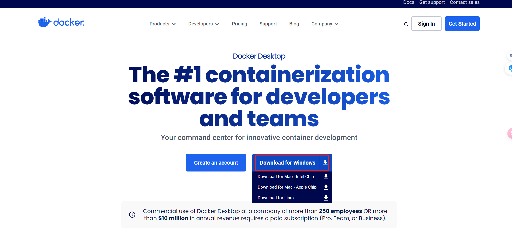
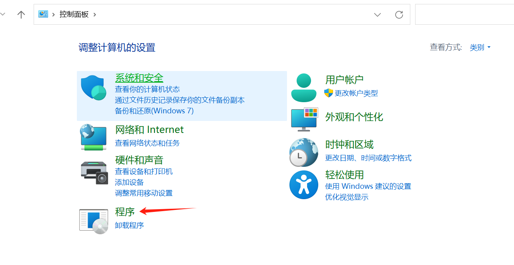
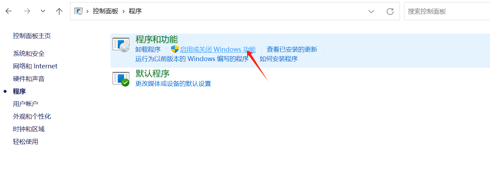
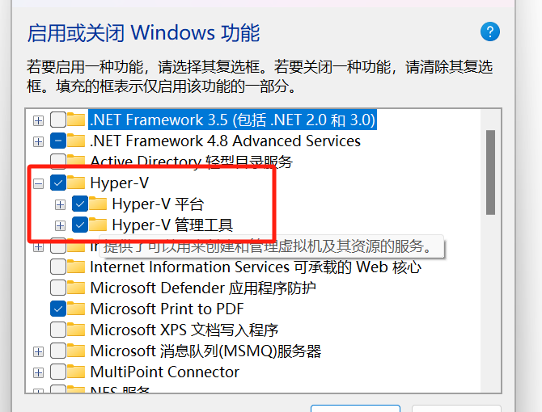

## docker入门学习
- 参考资料 https://vuepress.mirror.docker-practice.com
### 下载docker桌面版
- 由于我是windows 系统，所以需要下载docker桌面版，以便使用命令行
- 下载地址：https://www.docker.com/products/docker-desktop/ 下载对应版本
  
- 要想在windows下运行docker,需要开启Hyper-V功能
  控制面板 > 程序 > 启用或关闭Windows功能，打开Hyper-V以及他的子功能
  
  
  
- 做好以上，则可以开始进行学习入门了