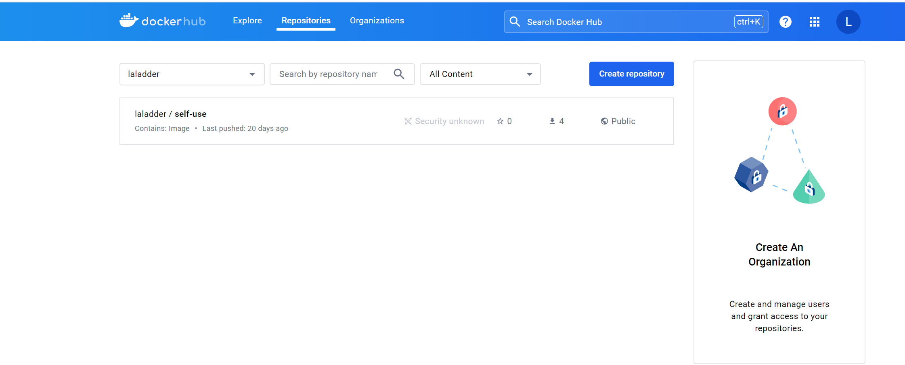

## 1. docker基础准备
- 参考资料 https://vuepress.mirror.docker-practice.com
### 下载docker桌面版
- 由于我是windows 系统，所以需要下载docker桌面版，以便使用命令行
- 下载地址：https://www.docker.com/products/docker-desktop/ 下载对应版本
  
- 要想在windows下运行docker,需要开启Hyper-V功能
  控制面板 > 程序 > 启用或关闭Windows功能，打开Hyper-V以及他的子功能
  
  
  
- 做好以上，则可以开始进行学习入门了

## 2. docker入门学习
### 1. docker的基本概念
**Docker** 包括三个基本概念
- 镜像（Image）
- 容器（Container）
- 仓库（Repository）
### Docker镜像（Image）
  **Docker镜像**是一个特殊的文件系统，除了提供容器运行时所需的程序、库、资源、配置等文件外，还包含了一些为运行时准备的一些配置参数（如匿名卷、环境变量、用户等）。镜像 不包含 任何动态数据，其内容在构建之后也不会被改变。
### Docker容器
镜像（```Image```）和容器（```Container```）的关系，就像是面向对象程序设计中的```类```和```实例```一样，镜像是静态的定义，容器是镜像运行时的实体。容器可以被创建、启动、停止、删除、暂停等。

容器的实质是进程，但与直接在宿主执行的进程不同，容器进程运行于属于自己的独立的**命名空间**(opens new window)。因此容器可以拥有自己的 root 文件系统、自己的网络配置、自己的进程空间，和自己的用户**ID**空间。

容器消亡时，容器存储层也随之消亡。因此，任何保存于容器存储层的信息都会随容器删除而丢失。

按照 Docker 最佳实践的要求，容器不应该向其存储层内写入任何数据，容器存储层要保持无状态化。所有的文件写入操作，都应该使用 数据卷（Volume）、或者 绑定宿主目录，在这些位置的读写会跳过容器存储层，直接对宿主（或网络存储）发生读写，其性能和稳定性更高。

数据卷的生存周期独立于容器，容器消亡，数据卷不会消亡。因此，使用数据卷后，容器删除或者重新运行之后，数据却不会丢失。
### Docker 仓库
当镜像构建完成之后，则可以在本机服务使用，但若想在其他服务器上使用，则需要一个集中的分发镜像的仓库
### Docker Registry 公开服务
Docker Registry 公开服务是开放给用户使用、允许用户管理镜像的 Registry 服务。一般这类公开服务允许用户免费上传、下载公开的镜像，并可能提供收费服务供用户管理私有镜像。
最常使用的 Registry 公开服务是官方的[Docker Hub](https://hub.docker.com/), 国内有[阿里加速器](https://www.aliyun.com/product/acr?source=5176.11533457&userCode=8lx5zmtu)，网易等。
### 私人仓库
Docker官方也提供了私人镜像仓库，以下是简单练习使用后的仓库
